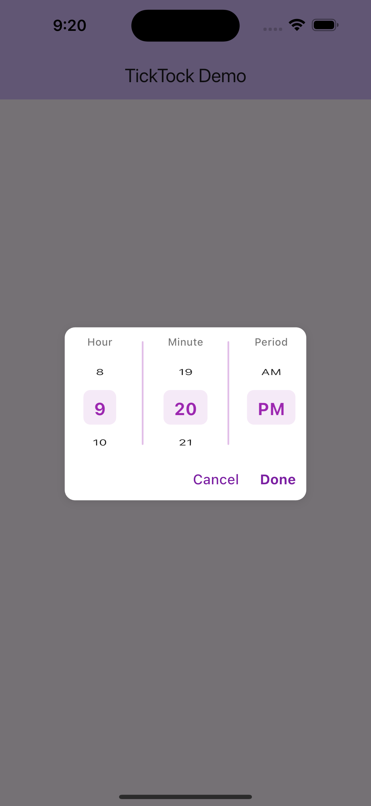

# TickTock ⏰

A customizable scrollable time picker widget for Flutter with intuitive scroll wheel interface for precise time selection.

# Screenshots





## Features

- 🎨 **Highly Customizable**: Extensive styling options for colors, fonts, and appearance
- 📱 **Scroll Interface**: Modern scroll wheel picker for hours, minutes, and AM/PM
- 🌍 **24-Hour Support**: Toggle between 12-hour and 24-hour formats
- 🔄 **Infinite Scroll**: Optional infinite scrolling for seamless time selection
- 🎯 **Precise Selection**: Dedicated columns for hours, minutes, and period
- 🎨 **Custom Labels**: Customizable text and styling for column labels
- 🔧 **Action Buttons**: Optional Done/Cancel buttons with custom styling
- ⚡ **Real-time Callbacks**: Continuous time updates during scrolling

## Installation

Add this to your package's `pubspec.yaml` file:

```yaml
dependencies:
  ticktock: ^0.0.1
```

Then run:

```bash
flutter pub get
```

## Quick Start

### Basic Usage

```dart
import 'package:flutter/material.dart';
import 'package:ticktock/ticktock.dart';

class MyApp extends StatelessWidget {
  @override
  Widget build(BuildContext context) {
    return MaterialApp(
      home: Scaffold(
        appBar: AppBar(title: Text('TickTock Example')),
        body: Center(
          child: TickTock(
            initialTime: TimeOfDay.now(),
            onTimeChanged: (time) {
              print('Selected time: ${time.format(context)}');
            },
          ),
        ),
      ),
    );
  }
}
```

### With Custom Styling

```dart
TickTock(
  initialTime: TimeOfDay(hour: 14, minute: 30),
  height: 250.0,
  onTimeChanged: (time) {
    print('Time changed: ${time.format(context)}');
  },
  style: TicktockStyle(
    selectedTimeColor: Colors.deepPurple,
    backgroundColor: Colors.purple.shade50,
    use24HourFormat: false,
    infiniteScroll: true,
    hourLabelText: 'Hours',
    minuteLabelText: 'Minutes',
    periodLabelText: 'AM/PM',
  ),
)
```

## Comprehensive Examples

### 1. 24-Hour Format with Action Buttons

```dart
class TimePicker24Hour extends StatefulWidget {
  @override
  _TimePicker24HourState createState() => _TimePicker24HourState();
}

class _TimePicker24HourState extends State<TimePicker24Hour> {
  TimeOfDay selectedTime = TimeOfDay.now();

  @override
  Widget build(BuildContext context) {
    return Column(
      children: [
        Text(
          'Selected: ${selectedTime.format(context)}',
          style: TextStyle(fontSize: 18, fontWeight: FontWeight.bold),
        ),
        SizedBox(height: 20),
        TickTock(
          initialTime: selectedTime,
          height: 300,
          onTimeChanged: (time) {
            setState(() {
              selectedTime = time;
            });
          },
          onTimeSelected: (time) {
            // Handle confirmed selection
            ScaffoldMessenger.of(context).showSnackBar(
              SnackBar(content: Text('Time confirmed: ${time.format(context)}')),
            );
          },
          onTimeCancelled: (time) {
            // Handle cancellation
            setState(() {
              selectedTime = TimeOfDay.now(); // Reset to current time
            });
          },
          style: TicktockStyle(
            use24HourFormat: true,
            infiniteScroll: true,
            showDoneButton: true,
            showCancelButton: true,
            selectedTimeColor: Colors.teal,
            backgroundColor: Colors.teal.shade50,
            hourLabelText: 'Hour (24h)',
            minuteLabelText: 'Minute',
            doneButtonText: 'Confirm',
            cancelButtonText: 'Reset',
            hourLabelTextStyle: TextStyle(
              fontSize: 13,
              fontWeight: FontWeight.w600,
              color: Colors.teal.shade700,
            ),
          ),
        ),
      ],
    );
  }
}
```

### 2. Dark Theme Picker

```dart
TickTock(
  initialTime: TimeOfDay.now(),
  height: 280,
  onTimeChanged: (time) => print('Dark theme time: $time'),
  style: TicktockStyle(
    backgroundColor: Colors.grey.shade900,
    selectedTimeColor: Colors.cyan,
    dialColor: Colors.cyan,
    hourTextStyle: TextStyle(
      fontSize: 16,
      fontWeight: FontWeight.w500,
      color: Colors.white70,
    ),
    selectedTimeTextStyle: TextStyle(
      fontSize: 22,
      fontWeight: FontWeight.bold,
      color: Colors.cyan,
    ),
    hourLabelTextStyle: TextStyle(
      fontSize: 12,
      fontWeight: FontWeight.w500,
      color: Colors.cyan.shade300,
    ),
    minuteLabelTextStyle: TextStyle(
      fontSize: 12,
      fontWeight: FontWeight.w500,
      color: Colors.cyan.shade300,
    ),
    periodLabelTextStyle: TextStyle(
      fontSize: 12,
      fontWeight: FontWeight.w500,
      color: Colors.cyan.shade300,
    ),
    hourLabelText: 'Hr',
    minuteLabelText: 'Min',
    periodLabelText: 'Period',
    infiniteScroll: true,
  ),
)
```

### 3. Minimal Design

```dart
TickTock(
  initialTime: TimeOfDay.now(),
  height: 200,
  showAmPm: true,
  onTimeChanged: (time) => print('Minimal time: $time'),
  style: TicktockStyle(
    backgroundColor: Colors.transparent,
    selectedTimeColor: Colors.black87,
    dialColor: Colors.grey.shade300,
    hourTextStyle: TextStyle(
      fontSize: 16,
      color: Colors.grey.shade600,
    ),
    selectedTimeTextStyle: TextStyle(
      fontSize: 20,
      fontWeight: FontWeight.w600,
      color: Colors.black87,
    ),
    hourLabelTextStyle: TextStyle(
      fontSize: 11,
      color: Colors.grey.shade500,
      letterSpacing: 0.5,
    ),
    minuteLabelTextStyle: TextStyle(
      fontSize: 11,
      color: Colors.grey.shade500,
      letterSpacing: 0.5,
    ),
    periodLabelTextStyle: TextStyle(
      fontSize: 11,
      color: Colors.grey.shade500,
      letterSpacing: 0.5,
    ),
  ),
)
```

### 4. Custom Labels & Multilingual Support

```dart
TickTock(
  initialTime: TimeOfDay.now(),
  onTimeChanged: (time) => print('Custom labels time: $time'),
  style: TicktockStyle(
    selectedTimeColor: Colors.orange,
    backgroundColor: Colors.orange.shade50,
    // Custom label text
    hourLabelText: 'Horas',
    minuteLabelText: 'Minutos', 
    periodLabelText: 'Período',
    // Custom label styling
    hourLabelTextStyle: TextStyle(
      fontSize: 14,
      fontWeight: FontWeight.bold,
      color: Colors.orange.shade800,
      letterSpacing: 1.0,
    ),
    minuteLabelTextStyle: TextStyle(
      fontSize: 14,
      fontWeight: FontWeight.bold,
      color: Colors.orange.shade800,
      letterSpacing: 1.0,
    ),
    periodLabelTextStyle: TextStyle(
      fontSize: 14,
      fontWeight: FontWeight.bold,
      color: Colors.orange.shade800,
      letterSpacing: 1.0,
    ),
    showDoneButton: true,
    doneButtonText: 'Confirmar',
    doneButtonTextStyle: TextStyle(
      fontSize: 16,
      fontWeight: FontWeight.bold,
      color: Colors.orange.shade700,
    ),
  ),
)
```

### 5. Dialog Integration

```dart
class TimePickerDialog extends StatelessWidget {
  final TimeOfDay initialTime;
  final ValueChanged<TimeOfDay> onTimeSelected;

  const TimePickerDialog({
    Key? key,
    required this.initialTime,
    required this.onTimeSelected,
  }) : super(key: key);

  @override
  Widget build(BuildContext context) {
    return AlertDialog(
      title: Text('Select Time'),
      content: SizedBox(
        height: 250,
        width: 300,
        child: TickTock(
          initialTime: initialTime,
          onTimeSelected: (time) {
            onTimeSelected(time);
            Navigator.of(context).pop();
          },
          onTimeCancelled: (_) {
            Navigator.of(context).pop();
          },
          style: TicktockStyle(
            showDoneButton: true,
            showCancelButton: true,
            selectedTimeColor: Theme.of(context).primaryColor,
            backgroundColor: Colors.transparent,
            infiniteScroll: true,
          ),
        ),
      ),
    );
  }

  static Future<TimeOfDay?> show(
    BuildContext context, {
    required TimeOfDay initialTime,
  }) {
    return showDialog<TimeOfDay>(
      context: context,
      builder: (context) => TimePickerDialog(
        initialTime: initialTime,
        onTimeSelected: (time) => Navigator.of(context).pop(time),
      ),
    );
  }
}

// Usage:
// TimeOfDay? selectedTime = await TimePickerDialog.show(
//   context,
//   initialTime: TimeOfDay.now(),
// );
```

## Customization Reference

### TicktockStyle Properties

#### Colors
| Property | Type | Default | Description |
|----------|------|---------|-------------|
| `selectedTimeColor` | Color | Colors.blue | Color for selected time values |
| `backgroundColor` | Color | Colors.white | Background color of picker |
| `dialColor` | Color | Colors.blue | Color for separators and accents |

#### Text Styling
| Property | Type | Default | Description |
|----------|------|---------|-------------|
| `hourTextStyle` | TextStyle | Default | Style for unselected items |
| `selectedTimeTextStyle` | TextStyle | Default | Style for selected items |
| `hourLabelTextStyle` | TextStyle | Default | Style for hour column label |
| `minuteLabelTextStyle` | TextStyle | Default | Style for minute column label |
| `periodLabelTextStyle` | TextStyle | Default | Style for AM/PM column label |

#### Behavior Options
| Property | Type | Default | Description |
|----------|------|---------|-------------|
| `use24HourFormat` | bool | false | Use 24-hour (00-23) vs 12-hour format |
| `infiniteScroll` | bool | false | Enable infinite scrolling |
| `showAmPm` | bool | true | Show AM/PM selector (12-hour only) |

#### Action Buttons
| Property | Type | Default | Description |
|----------|------|---------|-------------|
| `showDoneButton` | bool | false | Show confirmation button |
| `showCancelButton` | bool | false | Show cancel button |
| `doneButtonText` | String | 'OK' | Text for done button |
| `cancelButtonText` | String | 'Cancel' | Text for cancel button |

#### Custom Labels
| Property | Type | Default | Description |
|----------|------|---------|-------------|
| `hourLabelText` | String | 'Hour' | Text for hour column label |
| `minuteLabelText` | String | 'Minute' | Text for minute column label |
| `periodLabelText` | String | 'Period' | Text for AM/PM column label |

### Widget Properties

#### TickTock
| Property | Type | Required | Description |
|----------|------|----------|-------------|
| `initialTime` | TimeOfDay | Yes | Starting time to display |
| `onTimeChanged` | ValueChanged<TimeOfDay>? | No | Called during scrolling |
| `onTimeSelected` | ValueChanged<TimeOfDay>? | No | Called when Done pressed |
| `onTimeCancelled` | ValueChanged<TimeOfDay>? | No | Called when Cancel pressed |
| `style` | TicktockStyle | No | Styling configuration |
| `height` | double | No | Height of picker (default: 200) |
| `showAmPm` | bool | No | Show AM/PM selector (default: true) |

## Common Use Cases

### 1. Settings Page Time Picker
```dart
ListTile(
  title: Text('Wake up time'),
  subtitle: Text(wakeUpTime.format(context)),
  onTap: () {
    showModalBottomSheet(
      context: context,
      builder: (context) => Container(
        height: 300,
        child: TickTock(
          initialTime: wakeUpTime,
          onTimeSelected: (time) {
            setState(() => wakeUpTime = time);
            Navigator.pop(context);
          },
          style: TicktockStyle(
            showDoneButton: true,
            infiniteScroll: true,
          ),
        ),
      ),
    );
  },
)
```

### 2. Alarm App Integration
```dart
TickTock(
  initialTime: alarmTime,
  onTimeChanged: (time) {
    setState(() => alarmTime = time);
    // Update alarm service immediately
    AlarmService.updateAlarm(alarmId, time);
  },
  style: TicktockStyle(
    use24HourFormat: true,
    selectedTimeColor: Colors.red,
    infiniteScroll: true,
    hourLabelText: 'H',
    minuteLabelText: 'M',
  ),
)
```

### 3. Appointment Booking
```dart
TickTock(
  initialTime: TimeOfDay(hour: 9, minute: 0),
  onTimeSelected: (time) {
    bookAppointment(selectedDate, time);
  },
  style: TicktockStyle(
    showDoneButton: true,
    doneButtonText: 'Book Appointment',
    selectedTimeColor: Colors.green,
    backgroundColor: Colors.green.shade50,
  ),
)
```

## Contributing

Contributions are welcome! Please feel free to submit a Pull Request.

## License

This project is licensed under the MIT License - see the [LICENSE](LICENSE) file for details.

## Changelog

See [CHANGELOG.md](CHANGELOG.md) for a list of changes.
